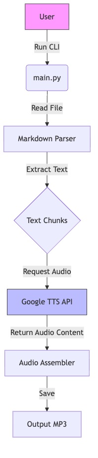

# TTS OU

A python-based CLI tool to convert Markdown academic resources into MP3 audio using Google Cloud's Text-to-Speech API.

## 🚀 Installation

### Option 1: The Reproducible Way (Recommended)
This project uses **Nix** to ensure a bit-for-bit reproducible environment.

1.  **Clone the repository:**
    ```bash
    git clone https://github.com/andre-amorim/tts-ou.git
    cd tts-ou
    ```

2.  **Activate the environment:**
    ```bash
    nix develop
    # Or if you use direnv:
    # direnv allow
    ```
    This will automatically install Python 3.14, `uv`, and all necessary system dependencies.

### Option 2: The Standard Python Way
If you don't use Nix, you can use `uv` (a fast Python package manager).

1.  Install [uv](https://github.com/astral-sh/uv).
2.  Sync dependencies:
    ```bash
    uv sync
    ```

## 🔑 Google TTS API Setup

To use this tool, you need a Google Cloud Project with the Text-to-Speech API enabled.

1.  **Create a Project** in the [Google Cloud Console](https://console.cloud.google.com/).
2.  **Enable the API:** Go to "APIs & Services" > "Library" and search for **"Cloud Text-to-Speech API"**. Enable it.
3.  **Create Credentials:**
    *   Go to "APIs & Services" > "Credentials".
    *   Click "Create Credentials" > "Service Account".
    *   Give it a name (e.g., `tts-cli-user`) and click "Create".
    *   Grant it the role **"Cloud Text-to-Speech API User"**.
    *   Click "Done".
4.  **Download Key:**
    *   Click on the newly created service account.
    *   Go to the "Keys" tab.
    *   Click "Add Key" > "Create new key" -> **JSON**.
    *   Save the downloaded file (e.g., `credentials.json`) securely on your machine.
5.  **Set Environment Variable:**
    Tell the application where to find your key:
    ```bash
    export GOOGLE_APPLICATION_CREDENTIALS="/path/to/your/credentials.json"
    ```
    *(Tip: You can add this line to your `.env` file or shell profile)*

## 🎧 Usage

Standard usage to convert a markdown file:

```bash
uv run python main.py convert input.md output.mp3
```

### Options

*   **Change Language**:
    ```bash
    uv run python main.py convert notes.md audio.mp3 --language "en-GB"
    ```
*   **Specific Voice**:
    ```bash
    uv run python main.py convert notes.md audio.mp3 --voice "en-GB-Neural2-A"
    ```
*   **Help**:
    ```bash
    uv run python main.py --help
    ```

## 🏗️ Architecture


